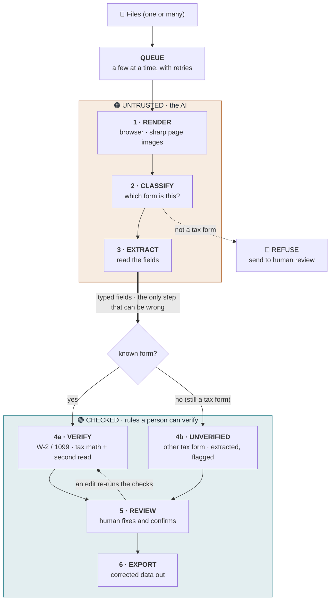

# TrueForm: Architecture & Data Flow

TrueForm rests on two ideas.

1. **The AI's reading of the form is the only thing we do not trust.** Everything after it is plain, checkable logic whose job is to decide which fields a person actually needs to look at.
2. **A form is data, not code.** The engine that reads and checks forms knows nothing specific about any one form. Each form is a small definition it reads at runtime, so adding a form means writing a definition, not changing the engine.

Read the diagram top to bottom and follow the data: it starts as a file, gets identified and read (the part that can be wrong), passes through checks a person can verify, and only the corrected version leaves.

## The pipeline



> The thick arrow crossing the middle is the **trust boundary**. Above it, the AI could be wrong. Below it, every result comes from fixed rules a person can check. The fork after it is the router: a known form (W-2, 1099) gets its tax checks; any other tax form is extracted and clearly flagged as unverified; anything that is not a tax form is refused rather than guessed.

### Text version

```
Files (one or many)
   |
   v
QUEUE  (a few at a time, retries on a hiccup)
   |
   v
UNTRUSTED  (the AI)
   1. RENDER    browser   file    ->  sharp page images
   2. CLASSIFY  server    images  ->  which form? (or "not a tax form" -> refuse)
   3. EXTRACT   server    images  ->  typed fields   (the only step that can be wrong)
   |
   v     * * *   TRUST BOUNDARY   * * *
   |
CHECKED  (rules a person can verify)
   4. ROUTE by form type:
        known (W-2, 1099)  ->  VERIFY: tax math + independent second read
        other tax form     ->  EXTRACTED, flagged unverified (no rules to check it against)
   5. REVIEW    browser   human fixes and confirms   (an edit re-runs the checks)
   6. EXPORT    browser   corrected data  ->  CSV, JSON, EFW2, tax-return map
```

## Forms are data: the three layers

The engine has no knowledge of any specific form. Form knowledge lives entirely in definition files.

| Layer | What it is | Where |
|-------|-----------|-------|
| **Definitions** | One data file per form: its fields (`schema`), its checks (`rules`), where each field maps downstream (`outputMapping`), and an escape hatch (`customValidate`) for logic that does not fit a rule. | `src/forms/w2.ts`, `src/forms/1099nec.ts`, `registry.ts` |
| **Engine** (knows no form) | `runValidation` interprets a definition's rules. `extractForm` builds the AI's extraction schema *from* a definition. `extractGeneric` discovers fields on a form with no definition. `classifyForm` identifies and routes. | `src/forms/engine.ts`, `extract-form.ts`, `extract-generic.ts`, `classify.ts` |
| **Router** | `/api/extract` classifies, picks the definition (or the generic path, or refuses), extracts, validates, and returns a result tagged by form type. | `src/app/api/extract/route.ts` |

**The rule DSL.** Most tax-form checks fit a handful of primitives, so a form's checks are mostly config, not code: `required`, `nonNegative`, `format` (a TIN is 9 digits), `cannotExceed`, `percentageOf` (Box 4 is 6.2% of Box 3), and `sumEquals`. Genuinely form-specific logic (the W-2 Medicare surtax, the Box 1 vs Box 5 deferral reconciliation) drops into `customValidate`. That split is the point: common rules are data, complex rules are code.

**One data shape.** Everything flows as a flat `FormInstance` (a map of field to value). W-2 keeps its richer nested shape and bridges in through a small adapter, so one engine serves both the detailed W-2 and any new flat form without forcing W-2 onto a lossy model.

## The three tiers

The router sorts every upload into one of three outcomes, and is always clear which one you are looking at.

| Tier | When | What runs |
|------|------|-----------|
| **Verified** | A known form (W-2, 1099-NEC) read with high confidence | Full extraction + that form's tax math + an independent second read |
| **Unverified** | Any other tax form (a 1098-T, say) | Fields are discovered and shown, clearly marked "extracted, not machine-checked." No tax rules run, because without the form's own rules there is nothing correct to check against. |
| **Refused** | Not a tax form at all | Set aside for a person. The tool never guesses and never runs the wrong form's rules on a return. |

The classifier is itself an AI call, so it is treated as untrusted: only a confident match to a known form earns the verified tier. This is the same "do not trust the model blindly" principle applied to routing.

## The checks

Each check catches a different kind of mistake, and none of them trusts the AI's confidence. Which checks run depends on the tier.

| Check | Runs on | What it catches |
|-------|---------|-----------------|
| **Tax math** | Verified forms | The numbers must line up. Box 4 should be 6.2% of Social Security wages; Box 6 should be 1.45% of Medicare wages plus a 0.9% surtax over $200k. Broken arithmetic gets flagged. |
| **Second reading** | Verified forms | A separate, free reader (Tesseract) reads the key money boxes and ID numbers again from the same spot on the page. If the two readings disagree, that is real evidence, not a hunch. It needs no tax math, so it is verification that works on any form whose fields it can locate reliably. |
| **Across documents** | A packet | The same Social Security number under two different names, or a big jump from last year, points to a mix-up or a misread. |
| **Box 12 codes** | W-2 | Box 12 uses letter codes (A to HH). A code that is not real is almost always a misread the tax math cannot see. |

## Handling many at once

Uploads run through a **bounded queue** (a few forms at a time) rather than all at once, so a large drop paces itself instead of firing a burst of AI calls that would trip rate limits. Each extraction **retries** transient failures (rate limits, gateway errors) with a short backoff, and fails fast on bad input. A progress bar shows how the batch is going. This comfortably handles a client's stack. For true bulk (many hundreds), the next steps are the asynchronous Batch API for cost and server-side processing for scale.

## Why it is built this way

- **The AI's reading is the only thing we do not trust.** The checking logic is plain, tested code with no AI in it, which is why it can have unit tests and be relied on.
- **Form knowledge is input, not code.** Pulling every form-specific detail out of the engine is what lets the same tool grow from one form to many by adding a definition, never by editing the engine.
- **Honest about what is checked.** A form the tool cannot verify is labeled unverified, not dressed up with a green check it cannot back up. You always know which tier you are in.
- **Fail safe on the unknown.** A misidentified form would run the wrong rules on a return, so anything short of a confident known match is refused rather than guessed.
- **Staying quiet on normal forms is a feature.** Many boxes are supposed to differ (a 401(k) makes taxable pay lower than total pay, and that is correct). The tool knows what is normal and does not cry wolf.
- **The person always wins.** A human confirmation overrides every automatic flag.
- **Privacy by design.** A client's data lives only in the browser tab and is gone when the tab closes. There is no database.

## What changed from the original

The original TrueForm was a single-purpose W-2 pipeline: the form's schema, its tax math, and its review were all hard-wired in code, and the whole app was typed on one W-2 shape. The current design pulls all of that form knowledge out into definition files and puts a classifier in front to route each upload. The deepest change in one line: **form knowledge went from being *inside* the engine to being *input* to the engine.** The router, the three tiers, the flat data model, and the batch queue all follow from that.
