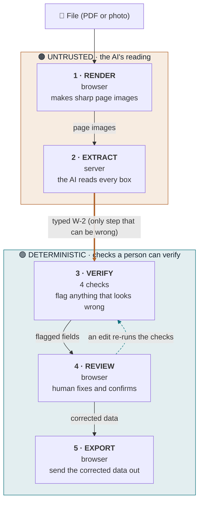

# TrueForm: Architecture & Data Flow

The whole tool rests on one idea: **the AI's reading of the form is the only thing we do not trust.** Everything after it is plain, checkable logic whose job is to decide which fields a person actually needs to look at.

Think of it as a careful assistant. The AI reads the W-2 fast, then a set of simple rules double-check that reading and flag only the few fields that need a human. Read the diagram top to bottom and follow the data: it starts as a file, becomes an untrusted reading, passes through checks a person can verify, and only the corrected version leaves.

## The pipeline



> The thick arrow crossing the middle is the **trust boundary**. Above it, the AI could be wrong. Below it, every result comes from fixed rules a person can check for themselves. The dashed arrow means that whenever a human edits a value, the checks run again automatically.

### Text version

```
File (PDF or photo)
   |
   v
UNTRUSTED  (the AI's reading)
   1. RENDER    browser    file    ->  sharp page images
   2. EXTRACT   server     images  ->  typed W-2   (only step that can be wrong)
   |
   v     * * *   TRUST BOUNDARY   * * *
   |
DETERMINISTIC  (checks a person can verify)
   3. VERIFY    4 checks   W-2     ->  flagged fields
   4. REVIEW    browser    human fixes and confirms   (an edit re-runs VERIFY)
   5. EXPORT    browser    corrected W-2  ->  CSV, JSON, EFW2, tax-return map
```

## The five stages

| # | Stage | Runs in | In plain words |
|---|-------|---------|----------------|
| 1 | **Render** | browser | Turns the uploaded PDF or photo into sharp page images. It renders at high resolution on purpose, because blurry text is the number one cause of misreads. |
| 2 | **Extract** | server | The AI reads every box and returns structured data. This is the one step that can be wrong, so nothing after it simply trusts the result. |
| 3 | **Verify** | server + browser | Four separate checks look for anything that does not add up and flag it (see below). No check relies on the AI feeling sure of itself. |
| 4 | **Review** | browser | The person sees the flagged fields first, fixes or confirms them, and the checks re-run instantly after every edit. |
| 5 | **Export** | browser | Sends the corrected data out as CSV, JSON (with an edit history), EFW2 (the official e-file format), and a guide to where each box goes on the tax return. |

## The four checks

Each check catches a different kind of mistake, and none of them trusts the AI's confidence.

| Check | Runs in | What it catches |
|-------|---------|-----------------|
| **Tax math** | server | The numbers on a W-2 must line up. Box 4 should be 6.2% of Social Security wages; Box 6 should be 1.45% of Medicare wages, plus a 0.9% surtax on pay over $200k. Anything that breaks the arithmetic gets flagged. |
| **Second reading** | browser | A different, free reader (Tesseract) reads the key money boxes and ID numbers again. If the two readings disagree, that is real evidence of a problem, not just a hunch. |
| **Across documents** | plain logic | Compares the forms in one client's packet. The same Social Security number under two different names, or a big jump from last year, points to a mix-up or a misread. |
| **Box 12 codes** | plain logic | Box 12 uses letter codes (A to HH). A code that is not a real one is almost always a misread, and the tax math cannot see it on its own. |

## Why it is built this way

- **The AI's reading is the only thing we do not trust.** The checking logic is plain, tested code with no AI in it, which is why it can have unit tests and be relied on.
- **One source of truth for the math.** The browser cannot do the tax math itself; it always asks the server. So the number a person sees is exactly the number the engine computed, never a second copy that could drift.
- **Staying quiet on normal forms is a feature.** Many boxes are supposed to differ (a 401(k) makes taxable pay lower than total pay, and that is correct). The tool knows what is normal and does not cry wolf. A tool that flags correct forms just trains people to ignore it.
- **The person always wins.** A human confirmation overrides every automatic flag.
- **Privacy by design.** A client's data lives only in the browser tab and is gone when the tab closes. There is no database.
