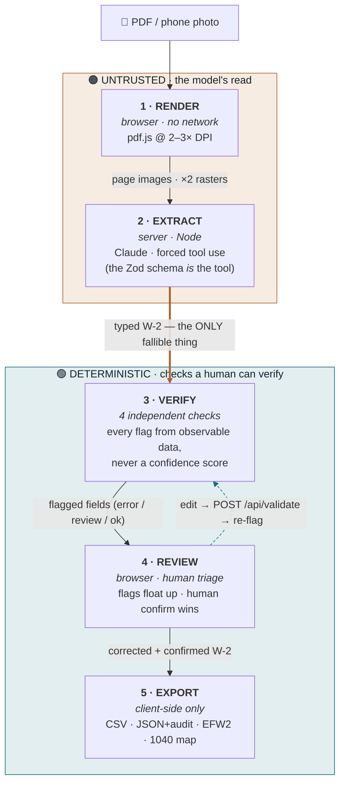

# TrueForm — Architecture & Data Flow

Five stages, one idea: **the model's read is the only untrusted input.** Everything
below the trust boundary is deterministic machinery for deciding what a human must
look at. Follow the data down the diagram — it starts as a file, becomes an untrusted
read, passes through checks a person can verify, and only the corrected version leaves.

## The pipeline



> The bold arrow crossing from **Extract → Verify** is the **trust boundary**:
> everything above it is fallible; everything below is deterministic. The dashed
> arrow from **Review → Verify** is the edit loop — the client can't recompute the
> tax math itself, so an edit posts back to the *same* server engine.

### ASCII fallback

```
        📄 PDF / phone photo
              │
  ┌───────────────────────────────── UNTRUSTED · the model's read ┐
  │           ▼                                                    │
  │  1. RENDER   (browser, no network)   pdf.js @ 2–3× DPI         │
  │           │  → page images ×2 rasters (crisp PNG + API JPEG)   │
  │           ▼                                                    │
  │  2. EXTRACT  (server)  Claude · forced tool use = Zod schema   │
  └───────────│──────────────────────────────────────────────────┘
              │  ══► typed W-2  ◄── the ONLY untrusted thing
  ═══════════ TRUST BOUNDARY ═══════════════════════════════════════
  ┌───────────│───────────────────── DETERMINISTIC · verifiable ───┐
  │           ▼                                                    │
  │  3. VERIFY  (4 independent checks)  a·math b·2nd-read           │
  │           │                         c·cross-doc d·Box12         │
  │           │  → flagged fields          ▲                        │
  │           ▼                            │ re-validate (loop)     │
  │  4. REVIEW  (browser, human)  edit ────┘  /api/validate         │
  │           │  → corrected + confirmed W-2                        │
  │           ▼                                                    │
  │  5. EXPORT  (client-side only)  CSV · JSON+audit · EFW2 · map   │
  └──────────────────────────────────────────────────────────────┘

  sessionStorage holds the whole session — survives refresh, gone on
  tab close. No database.
```

## Stage by stage

| # | Stage | Runs | What it does |
|---|-------|------|--------------|
| 1 | **Render** | browser · no network | pdf.js rasterizes at **2–3× DPI** (72 DPI blurs box text into a smudge the model misreads). Emits `RenderedPage[]` — plus a *second*, downscaled 1568px JPEG for the API, since the vision model shrinks images anyway. |
| 2 | **Extract** | server (Node) | `POST /api/extract` → Claude with **forced tool use**: the Zod schema is handed over as the tool, and the output is re-checked with `safeParse`. All pages go in one call. Returns a **typed W-2 — the only fallible thing in the system.** |
| 3 | **Verify** | server + browser | Four checks that fail on independent axes (see below). Every flag comes from observable data, never a model confidence score. |
| 4 | **Review** | browser · human | Flags float to the top; keyboard triage (`n` = next flag). Editing a field posts back to `/api/validate` (the same server engine) — the client never recomputes the math. A human **confirm** overrides every check. |
| 5 | **Export** | client-side only | The **corrected draft** — never the raw read — as CSV, JSON (+ audit trail), **EFW2** (the real SSA electronic-filing record layout), and a Box→1040 import map. PII never round-trips the server to be exported. |

## The four verification checks

The reason this is more than an OCR wrapper: each check catches a different class of
error, and none of them trusts the model's confidence.

| Check | Where | Catches |
|-------|-------|---------|
| **a · Tax math** | server (`lib/validation.ts`) | Box 4 = 6.2% of (Box 3 + 7); Box 6 = 1.45% of Box 5 **+ 0.9% surtax over $200k**; SS wage-base cap; withholding ≤ wages; EIN/SSN format. Reconciles Box 1 vs 5 against Box 12 deferrals instead of false-flagging normal differences. |
| **b · Second read** | browser (`review/cross-read.ts`) | An **independent** Tesseract OCR of the money boxes + IDs — a genuinely different engine, so agreement is real evidence. Generous crop + *presence* (not equality) to avoid false alarms. |
| **c · Cross-document** | pure (`review/reconcile.ts`) | Same SSN under two names (wrong client's form); year-over-year wage/withholding/employer swings. The packet *is* the history — no database needed. |
| **d · Box 12 sanity** | pure (`review/box12-codes.ts`) | A Box 12 code that isn't a real IRS code (A–HH) — a likely misread the tax math can't see. Added *because testing real W-2s surfaced it.* |

## Design principles (enforced by the file structure)

- **The model's output is the only untrusted input.** `src/lib` and `src/review`
  are almost entirely pure functions over the `W2` type — testable, no I/O — which
  is why the trust logic has unit tests and the React/network code lives at the edges.
- **One source of truth for the math.** The client physically cannot validate; it
  must call `/api/validate`, so the number a preparer sees can never diverge from the
  number the engine computes.
- **Silence on normal forms is a feature.** Deferral reconciliation, Roth exclusion,
  and "no readable signal → no flag" all exist so the tool doesn't cry wolf. A tool
  that flags correct forms just trains you to ignore it.
- **Every check is human-overridable.** A `confirm` beats every automated flag.
- **Privacy by architecture.** `sessionStorage` (not `localStorage`, wiped on tab
  close), a full-res raster that never leaves the browser, and client-side exports.
